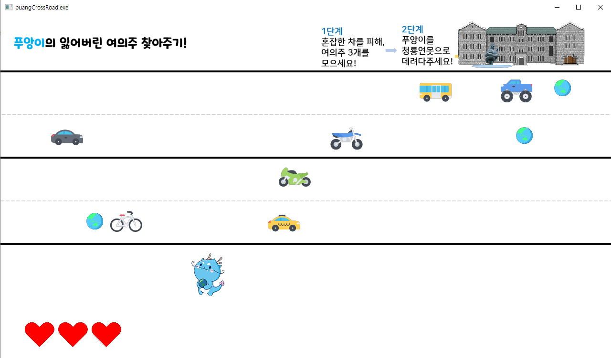
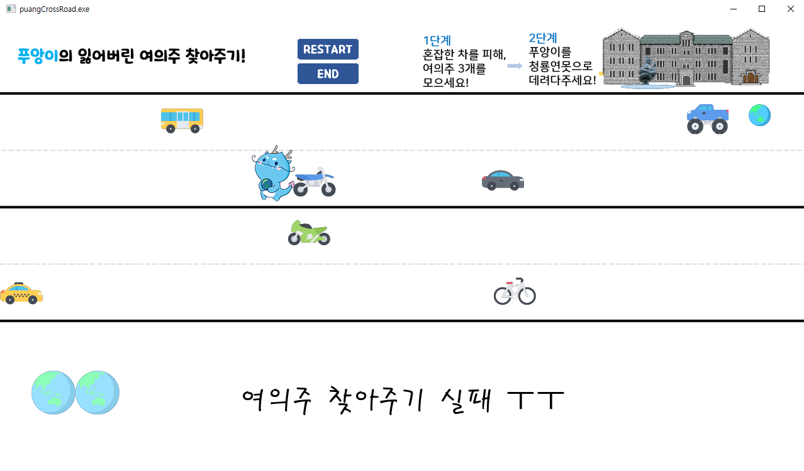
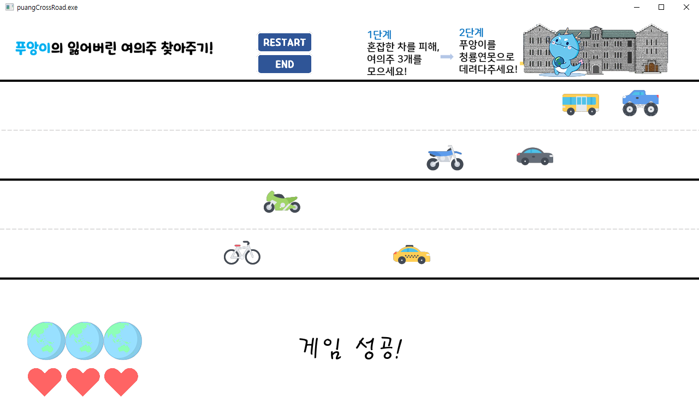

# puangCrossRoad
## 게임설명 
[방탈출 과제](https://github.com/shinysong/puang-bangtal.git)때도 푸앙이를 이용하였으나, 개인과제에선 새로운 방식의 게임을 만들어보았습니다.

학교 앞이 횡단보도도 없이 항상 혼잡해서 마치 길건너기 게임을 하면서 다니는 학생들의 모습에서 아이디어를 얻고,  
학교 마스코트인 푸앙이를 활용한 길건너기 게임을 만들었습니다.

소리와 같이 나오기 때문에 유튜브에 간단한 플레이 영상을 업로드 하였으니, 아래 링크를 참고해주시면 감사하겠습니다.   
[푸앙이의 여의주 찾아주기](https://youtu.be/DsoBETubca8)

### 시작화면
첫화면에는 게임설명이 적혀 있습니다.
키보드 방향키를 이용하여, 차를 피하고 여의주를 모아 푸앙이를 집으로 데려다줍니다.

### 중간화면
차는 각각 다른 속도와 방향에서 나오고, 여의주는 랜덤 타이밍에 등장하기 때문에,   
잘 피해서 목적지인 푸앙이의 집인 청룡연못으로 데려다줍니다.

### 실패화면
차에 3번 닿으면 게임 실패입니다. 

### 성공화면
여의주를 다모아서 목적지로 가면 성공하고,
여의주를 다 모으지 않고, 목적지로 가면 "여의주가 부족해!"라는 메시지 창이 뜹니다.

